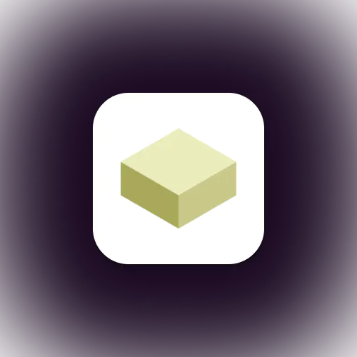
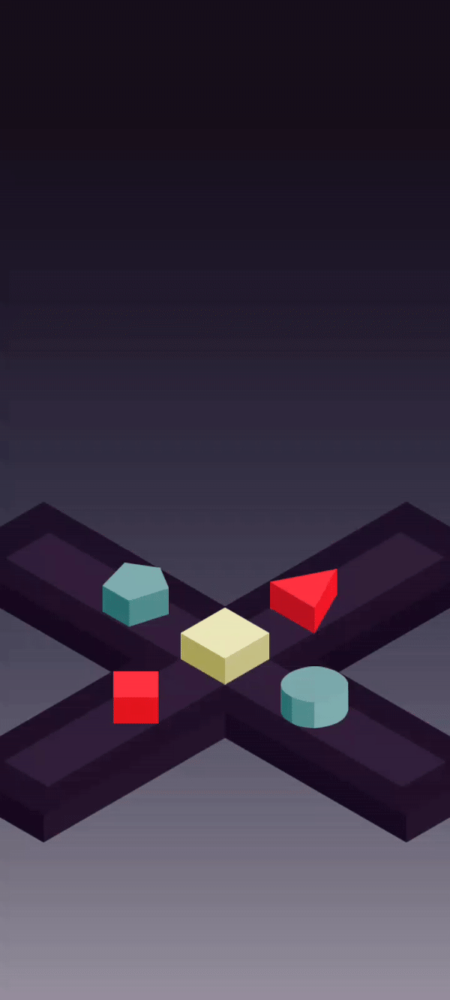

# ShapeSwipe
<div align="center">
<h1 align="center">

<br>ShapeSwipe
</h1>
<h3>◦ ShapeSwipe : Fidget & Play With Shapes.</h3>
<h3>◦ Developed with the software and tools listed below.</h3>

<p align="center">

</p>


</div>

---

## 📒 Table of Contents
- [📒 Table of Contents](#-table-of-contents)
- [📍 Overview](#-overview)
- [🚀 Getting Started](#-getting-started)
- [🗺 Roadmap](#-roadmap)
- [🤝 Contributing](#-contributing)
- [📄 License](#-license)
- [👏 Acknowledgments](#-acknowledgments)

---

## 📍 Overview

<div align="center">
  
</div>

---

## 🚀 Getting Started

### ✔️ Prerequisites

Before you begin, ensure that you have the following prerequisites installed:
> - Unity 2020.3.20

### 📦 Installation

1. Install the dependencies:
> - Install [Unity 2020.3.20](https://unity.com/releases/editor/whats-new/2020.3.20). (This project has been developed utilizing Unity Editor version 2020.3.20. Please be advised that using alternative versions may result in compatibility issues and unexpected errors)

2. Clone the ShapeSwipe repository:
```sh
git clone https://github.com/R3-da/ShapeSwipe
```

3. Change to the project directory:
> - Open the cloned projet in the Unity Editor

---

### 🎮 Using ShapeSwipe

For now, ShapeSwipe represents an endlessly engaging fidgeting game, devoid of specific objectives, scores, or defined goals. It offers a satisfying experience, allowing players to freely enjoy the act of shape-swiping.

---


## 🗺 Roadmap

> - [X] Build Playable Prototype With No Obstacles
> - [ ] Add Random Falling Mussels
> - [ ] Add Score Logic
> - [ ] Build Main Menu UI

---

## 🤝 Contributing

Contributions are always welcome! Please follow these steps:
1. Fork the project repository. This creates a copy of the project on your account that you can modify without affecting the original project.
2. Clone the forked repository to your local machine using a Git client like Git or GitHub Desktop.
3. Create a new branch with a descriptive name (e.g., `new-feature-branch` or `bugfix-issue-123`).
```sh
git checkout -b new-feature-branch
```
4. Make changes to the project's codebase.
5. Commit your changes to your local branch with a clear commit message that explains the changes you've made.
```sh
git commit -m 'Implemented new feature.'
```
6. Push your changes to your forked repository on GitHub using the following command
```sh
git push origin new-feature-branch
```
7. Create a new pull request to the original project repository. In the pull request, describe the changes you've made and why they're necessary.
The project maintainers will review your changes and provide feedback or merge them into the main branch.

---

## 📄 License

This project is licensed under the [MIT License](LICENSE) - see the [LICENSE](LICENSE) file for additional info.

---

## 👏 Acknowledgments

> - The project idea was mainly inspired by Color Switch using shapes instead of colors.

---
